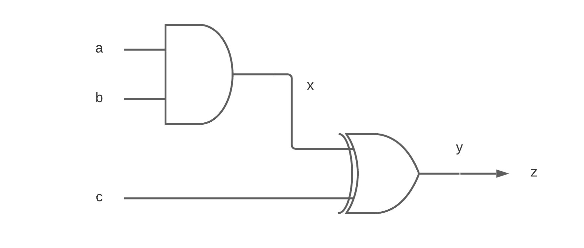
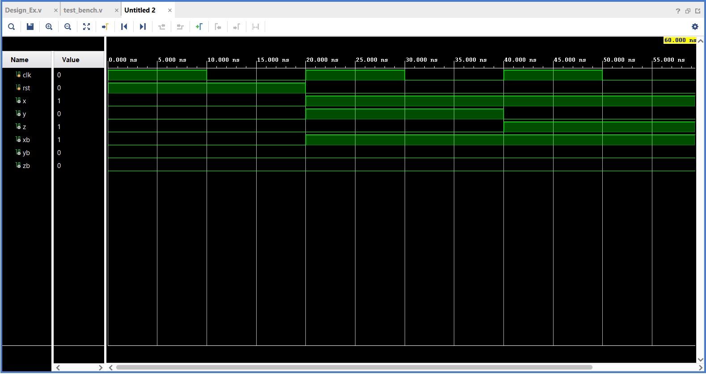

# Blocking and Non-Blocking

---
Let us model a simple design that is given in figure 1 in Verilog. There are many ways to optimally model the design but here we will learn the difference between blocking and non-blocking assignments in Verilog.

###  Boolean Equations

We will model our design based on the equations given below.

```
x = a and b
y = x xor c
z = y

```

 *Fig 1. Design*

There are two ways to assign values to LHS in Verilog. But why do we require two methods to perform the same task? When it comes to Hardware Descriptive Language (HDL), it is not as same as software programing, where each line is executed sequentially. In HDL, each line of code is translated to a hardware block by executing the code concurrently. Blocking and non-blocking are the two operators used to assign LHS to RHS. The question is: which operator is used in what scenario?

##  Blocking

Blocking assignment operator is an *equal* sign '='. The name blocking derived from its behavior of operation. When a blocking operator is used, the next line of code is blocked until the RHS is evaluated and assigned to LHS.

```
always@(posedge clk)
        begin
            if(rst) begin
                xb = 0;
                yb = 0;
                zb = 0;
            end else begin           
                xb = a | b;          
                yb = xb ^ c;         
                zb = yb;             
            end
        end
```
In the above example, *a* OR *b* is immediately assigned to *xb*. The expression for *yb* is not evaluated until *xb* is updated. Expression for *yb* is blocked until *xb* is updated, hence,  the name *blocking*. Similarly, *zb* is blocked until *yb* is updated. All the three statements are executed in the same clock cycle one after the other.

##  Non-Blocking

Non-blocking assignment operator is a *less than equal to* sign '<='. When a non-blocking operator is used, the LHS is not updated until it executes all the statements in the always block.

```
always@(posedge clk)
        begin
            if(rst) begin
                x <= 0;
                y <= 0;
                z <= 0;
            end else begin          
                x <= a | b;         
                y <= x ^ c;         
                z <= y;             
            end
        end
```
In the above example, LHS is not updated  until it evaluates all the RHS expressions. Therefore, it takes 3 clock cycles for *z* to be updated with the correct results.

 *Fig 2. Simulation Results*

From Fig 2,  *xb, yb, zb* are blocking outputs and *x, y, z* are non-blocking outputs. We are going to concentrate from 20ns to 80ns to understand the concept. Input a, b, c change at  20ns simultaneously, all the blocking outputs are evaluated and updated immediately. Whereas, the non-blocking outputs require three clock cycles to produce the correct output. At 20ns,  expression for *x* evaluates *a* and *b* with current inputs; expression for *y* evaluates with current input of *c* and previous output of *x* because *x* is not yet updated with the new value. Similarly, *z* is evaluated with previous value of *y*.

> Hence, we can conclude that when modelling purely combinational circuits blocking is preferred, while modeling sequential circuits non-blocking is preferred.

##### Reference
1. [Cummings, Clifford E. "Verilog Nonblocking Assignments With Delays, Myths & Mysteries." Synopsys User Group Meeting (SNUG), Boston. 2002.](http://www.sunburst-design.com/papers/CummingsSNUG2000SJ_NBA_rev1_2.pdf)
